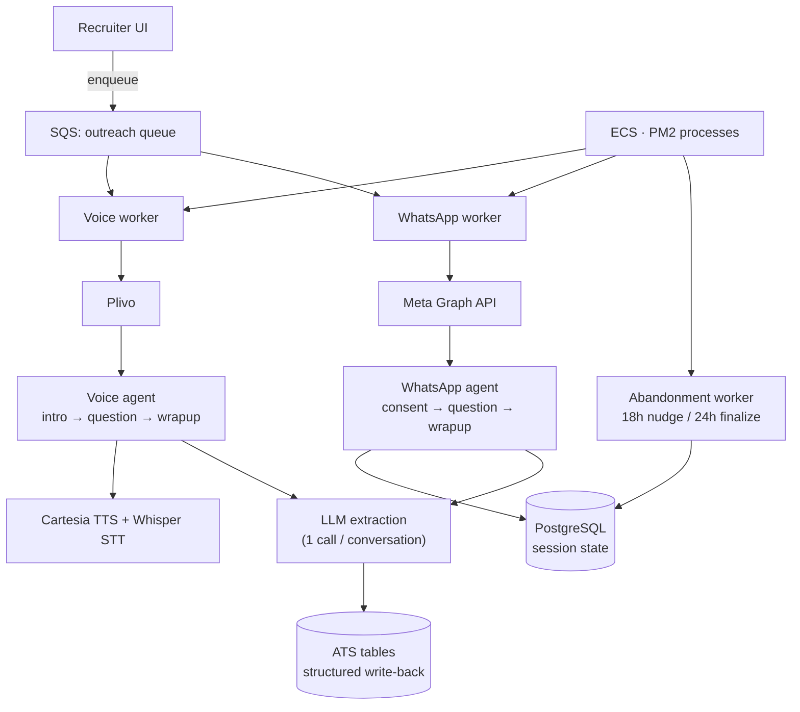

# Multi-Channel Autonomous Candidate Outreach (support WhatsApp and Voice AI)

---

## Problem

Before a recruiter talks to a candidate, someone has to collect five basics: salary, expected salary, notice period, location, work status. Doing this by hand doesn't scale — and "just plug in an AI" breaks in three ways:

One channel isn't enough. Some candidates never answer calls; others never reply to texts. You need both voice and WhatsApp — but building them as separate systems doubles the work.
Conversations don't become data on their own. A great call still just leaves a sentence in a notes field, not a searchable, filterable record.
Partial replies get lost. A candidate who answers 3 of 6 WhatsApp questions and goes quiet is still valuable — but without tracking progress, that looks identical to never replying at all.

---

## Solution

**Same playbook, two channels.** Voice and WhatsApp run on the same underlying design — just different scripts (voice: greet → ask → wrap up; WhatsApp: get consent → ask → wrap up). Adding a third channel later means reusing this playbook, not building from scratch.

**Simple, event-driven logic** no heavy framework. Each message or call turn is handled as it comes in, triggered directly by the incoming webhook. No complex engine running in the background — just a straightforward decision at each step.

**Memory that fits how each channel behaves**. A voice call is a live, ~30-second conversation, so its state lives in memory for that call. WhatsApp replies can come hours later from anywhere, so its state is saved in the database and picked up wherever it left off.

**Most replies are understood instantly**, without AI. Simple word-matching (including Hindi-English mixed phrases like haan, nahi, kitna) handles about 99% of replies immediately, for free. AI only steps in for the tricky ones.

V**oice never makes the candidate wait**. Every question is pre-recorded in advance, and the next question is prepared in the background while the candidate is still answering the current one — so there's no dead air.

**One AI call per conversation**, not per message. Instead of asking AI to think on every reply, it's used once at the end — to read the whole conversation and pull out salary, notice period, location, etc., and save them directly to the system.

**Nothing gets lost**. Duplicate messages are ignored, failed sends are retried, and candidates who go quiet get a nudge before their session is closed out — so partial answers are never thrown away.

**Built to grow. Adding a new channel** (like SMS) reuses the same core pieces — no need to rebuild the whole system each time.

---

## Architecture

**Stack:** Node/Express · Plivo (voice) · Meta Graph API (WhatsApp, direct, no SDK) · Cartesia TTS + Whisper STT · `gpt-4o-mini` with `gemini-2.5-flash` fallback · PostgreSQL (JSONB session state) · SQS · ECS/PM2.

---

## Result

- **End-to-end autonomy** — dial/message → converse → classify → extract → update the ATS, with a human in the loop only on explicit escalation.
- **One contract, two channels** — a third channel is a config + node triple, not a new system.
- **Structured data, not transcripts** — five ATS fields populated automatically on every completed conversation.
- **Durable by construction** — conversations survive restarts, duplicate webhooks, and candidate abandonment without data loss.
- **Cost and latency bounded architecturally** — one LLM call per conversation, not per turn; no synchronous TTS on the voice critical path.

### What's next
- Move voice session state out of in-process memory to support horizontal scaling.
- Add real-time streaming voice to support barge-in (candidate interrupting mid-prompt).
- Promote screening questions from code config to a database table for per-job customization without a deploy.
- Add automated tests around the agent node functions — they're pure `(state, context) → result`, which makes them cheap to cover.

---

## Extending it

Extending it
- Add a new question: just update the config file — no database changes needed.
- Add a new channel (e.g. SMS): plug in using the same reusable building blocks already used for voice and WhatsApp — no need to rebuild the system from scratch.
- Teach it to recognize a new phrase: add it to the keyword list. Anything it doesn't recognize still falls back to AI, so nothing goes unanswered
